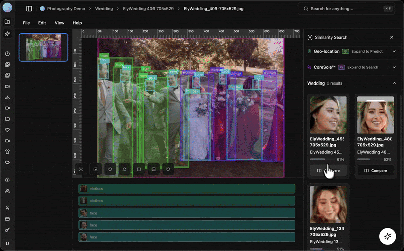

[](https://coreviz.io)

<div align="center">
    <h1>CoreViz</h1>
    <a href="https://coreviz.io/">Home</a>
    <span>&nbsp;&nbsp;•&nbsp;&nbsp;</span>
    <a href="https://lab.coreviz.io/">Studio</a>
    <span>&nbsp;&nbsp;•&nbsp;&nbsp;</span>
    <a href="https://github.com/coreviz/cli">CLI</a>
    <span>&nbsp;&nbsp;•&nbsp;&nbsp;</span>
    <a href="https://github.com/coreviz/sdk">SDK</a>
    <span>&nbsp;&nbsp;•&nbsp;&nbsp;</span>
    <a href="https://docs.coreviz.io/">Docs</a>
    <span>&nbsp;&nbsp;•&nbsp;&nbsp;</span>
    <a href="https://x.com/withcoreviz">X</a>
    <span>&nbsp;&nbsp;•&nbsp;&nbsp;</span>
    <a href="https://www.linkedin.com/company/coreviz/">LinkedIn</a>
    <span>&nbsp;&nbsp;•&nbsp;&nbsp;</span>
    <a href="mailto:team@coreviz.io">Contact</a>
  <br />
  <br />

CoreViz is a Vision AI platform for teams and individuals working with thousands of visual assets.

  <p align="center">
    <a href="https://coreviz.io"></a>
  </p>
</div>


# @coreviz/sdk

Easily integrate powerful image analysis and manipulation features into your applications with CoreViz (https://coreviz.io/) 's Vision SDK.

## Introduction

The CoreViz SDK powers the [coreviz.io](https://coreviz.io/) platform and the [CoreViz CLI](https://github.com/coreviz/cli), providing fast, consistent AI image analysis and manipulation capabilities across environments.

You can try out the live demos and tools built with this SDK at [coreviz.io/tools](https://coreviz.io/tools), including:

- **Image Description**: Generate detailed captions for any image. [→ Demo](https://coreviz.io/tools/describe)
- **Tagging / Classification**: Classify images with custom or general prompts. [→ Demo](https://coreviz.io/tools/tag)
- **Image Editing**: Modify or retouch images using generative AI based on text instructions. [→ Demo](https://coreviz.io/tools/edit)

Check out [coreviz.io/tools](https://coreviz.io/tools) to explore these features interactively.


## Installation

```bash
npm install @coreviz/sdk
```

### React Native / Expo

When using this SDK in Expo / React Native, install the Expo image utilities (used for `resize`):

```bash
npx expo install expo-image-manipulator expo-file-system
```

Notes:
- **Local mode** (`mode: 'local'`) for `tag()` / `embed()` is **not supported** on React Native / Expo.

## Configuration

To use the AI features, you need to instantiate the `CoreViz` class with your API key.

```typescript
import { CoreViz } from '@coreviz/sdk';

const coreviz = new CoreViz({
    apiKey: process.env.COREVIZ_API_KEY // or 'your_api_key_here'
});
```

## API Reference

### `coreviz.describe(image)`

Generates a detailed text description of an image.

**Parameters:**
- `image` (string): The image to describe. Can be a base64 string or a URL.

**Returns:**
- `Promise<string>`: A text description of the image.

**Example:**

```typescript
const description = await coreviz.describe('https://example.com/image.jpg');
console.log(description);
```

### `coreviz.tag(image, options)`

Analyzes an image and returns relevant tags or classifications based on a prompt.

**Parameters:**
- `image` (string): The image to analyze. Can be a base64 string or a URL.
- `options` (object):
  - `prompt` (string): The context or question to guide the tagging (e.g., "What objects are in this image?").
  - `options` (string[], optional): A specific list of tags to choose from.
  - `multiple` (boolean, optional): Whether to allow multiple tags (default: `true`).

**Returns:**
- `Promise<TagResponse>`: An object containing:
  - `tags` (string[]): The list of identified tags.
  - `raw` (unknown): The raw API response.

**Example:**

```typescript
const result = await coreviz.tag('base64_image_string...', {
  prompt: "Is this indoor or outdoor?",
  options: ["indoor", "outdoor"],
  multiple: false
});
console.log(result.tags); // ["indoor"]
```

### `coreviz.edit(image, options)`

Modifies an image based on a text prompt using generative AI.

**Parameters:**
- `image` (string): The image to edit. Can be a base64 string or a URL.
- `options` (object):
  - `prompt` (string): Description of the desired edit.
  - `aspectRatio` (string, optional): Target aspect ratio (`'match_input_image'`, `'1:1'`, `'16:9'`, `'9:16'`, `'4:3'`, `'3:4'`).
  - `outputFormat` (string, optional): `'jpg'` or `'png'`.
  - `model` (string, optional): The model to use (default: `'flux-kontext-max'`).

**Returns:**
- `Promise<string>`: The edited image as a base64 string or URL.

**Example:**

```typescript
const editedImage = await coreviz.edit('https://example.com/photo.jpg', {
  prompt: "Make it look like a painting",
  aspectRatio: "1:1"
});
```

### `coreviz.generate(prompt, options)`

Generates an image based on a text prompt, optionally using reference images for style/structure guidance.

**Parameters:**
- `prompt` (string): The text description of the image(s) to generate.
- `options` (object, optional):
  - `referenceImages` (string[], optional): Array of reference images (URL/base64) to guide generation.
  - `aspectRatio` (string, optional): Target aspect ratio (e.g., `'1:1'`, `'16:9'`, `'4:3'`).
  - `model` (string, optional): The model to use (default: `'google/nano-banana-pro'`).

**Returns:**
- `string`: The generated images as a URL.

**Example:**

```typescript
const images = await coreviz.generate("A futuristic city skyline", {
  aspectRatio: "16:9"
});
```

### `coreviz.embed(input, options?)`

Generates embeddings for image or text inputs, enabling semantic search and similarity comparison. Use with `coreviz.similarity(embeddingA, embeddingB)` to compare two images or an image and a text.

**Parameters:**
- `input` (string): The text string or image (URL/base64) to embed.
- `options` (object, optional):
  - `type` ('image' | 'text', optional): Explicitly define the input type.
  - `mode` ('api' | 'local', optional): Execution mode (default: `'api'`). `'local'` runs in-browser/node using transformers.js.

**Returns:**
- `Promise<EmbedResponse>`: An object containing:
  - `embedding` (number[]): The high-dimensional vector representation.

**Example:**

```typescript
const { embedding } = await coreviz.embed('A photo of a sunset');
```

### `coreviz.similarity(embeddingA, embeddingB)`

Calculates the degree of similarity between two embeddings.

**Parameters:**
- `embeddingA` (number[]): The first image/text embedding.
- `embeddingB` (number[]): The second image/text embedding.

**Returns:**
- `number`: A similarity score between -1 and 1.

**Example:**

```typescript
const similarity = coreviz.similarity(embeddingA, embeddingB);
```

### `coreviz.resize(input, maxWidth?, maxHeight?)`

Utility function to resize images client-side or server-side before processing. Also available as a standalone import.

**Parameters:**
- `input` (string | File): The image to resize.
- `maxWidth` (number, optional): Maximum width (default: 1920).
- `maxHeight` (number, optional): Maximum height (default: 1080).

**Returns:**
- `Promise<string>`: The resized image as a base64 string.

**Example:**

```typescript
const resized = await coreviz.resize(myFileObject, 800, 600);
// or import { resize } from '@coreviz/sdk';
```
